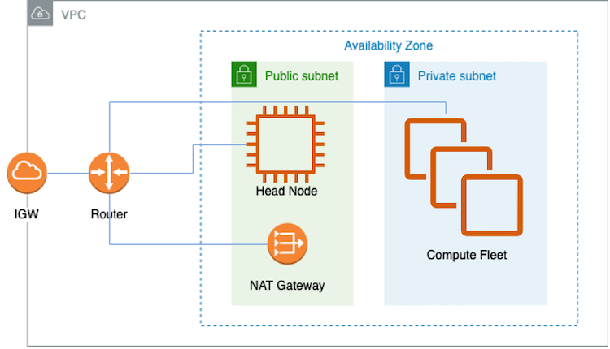

# Train a model on AWS Trn1 ParallelCluster

## Introduction

This document explains how to use AWS ParallelCluster to build HPC compute cluster that uses trn1 compute nodes to run your distributed ML training job. Once the nodes are launched, we will run a training task to confirm that the nodes are working, and use slurm commands to check the job status. In this tutorial, we will use AWS pcluster command to run a yaml file in order to generate the cluster. As an example, we are going to launch multiple trn1.32xl nodes in our cluster.

We are going to set up our ParallelCluster infrastructure as below:

As shown in the figure above, inside a VPC, there are two subnets, a public and a private ones. Head node resides in the public subnet, while the compute fleet (in this case, trn1 instances) are in the private subnet. A Network Address Translation (NAT) gateway is also needed in order for nodes in the private subnet to connect to clients outside the VPC. In the next section, we are going to describe how to set up all the necessary infrastructure for Trn1 ParallelCluster.

## Prerequisite infrastructure

### VPC
A ParallelCluster requires a VPC that has two subnets and a Network Address Translation (NAT) gateway as shown in the diagram above. [Here](./examples/general/network/vpc-subnet-setup.md) are the instructions to to create hte VPC and enable auto-assign public IPv4 address for the public subnet. 

### Key pair
A key pair is needed for access to the head node of the cluster. You may use an existing one or create a new key pair by following the instruction [here](https://docs.aws.amazon.com/AWSEC2/latest/UserGuide/create-key-pairs.html#having-ec2-create-your-key-pair "Create key pair")

### AWS ParallelCluster Python package

AWS ParallelCluster Python package is needed in a local environment (i.e., your Mac/PC desktop with a CLI terminal or an AWS Cloud9) where you issue the command to launch the creation process for your HPC environment in AWS.

## Create a cluster

See table below for script to create trn1 ParallelCluster:

|Cluster      | Link |
|-------------|------------------|
|16xTrn1 nodes   | [trn1-16-nodes-pcluster.md](./examples/cluster-configs/trn1-16-nodes-pcluster.md)  |

## Launch training job

See table below for script to launch a model training job on the ParallelCluster:

|Job      | Link  |
|-------------|-------------------|
|BERT Large   | [dp-bert-launch-job.md](./examples/jobs/dp-bert-launch-job.md) |

## Security

See [CONTRIBUTING](CONTRIBUTING.md#security-issue-notifications) for more information.

## License

This library is licensed under the Amazon Software License.

